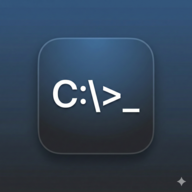

  

  # 🦅 **ECHO_OFF v5.1: EL PROTOCOLO "FUERZA DELTA"** 🦅
  ### *Nivel de Acceso: CLASIFICADO - Sin Rastro Terrenal*

  
  
  

 

<h2 align="center">
  <a href="https://prismalab-arm64.github.io/ECHO_OFF/">⚡ INICIAR TRANSMISIÓN SEGURA ⚡</a>
</h2>

---

## 🛰️ PROTOCOLO DE EXTRACCIÓN DE DATOS (NIVEL NASA)

**ECHO_OFF v5.1** es la culminación de la guerra contra la persistencia de datos. Hemos implementado el motor **Delta v5**, cerrando el 0.001% de las fugas que quedaban.

### 🛡️ BLINDAJE MULTIMEDIA REFORZADO (CANVAS RENDERING)
*   **Aniquilación de Etiquetas Nativas:** Hemos erradicado las etiquetas ``, `<audio>` y `<video>`. El navegador ya no detecta "archivos" que se puedan descargar.
*   **Motor de Renderizado Delta:** Todo el contenido (imágenes y videos) se materializa directamente en un **Canvas de HTML5**. Es un dibujo de píxeles volátiles en memoria RAM, sin enlace físico a disco.
*   **Audio "Black Box" v5:** Sonido procesado mediante búfer de audio directo. Sin interfaces de descarga, sin menús contextuales.

---

## 💥 SECUENCIA DE DESINTEGRACIÓN "OBSIDIAN"

*   **Tema Obsidian Ops:** Interfaz en **Negro Absoluto (#000)** forzado para evitar la fatiga visual y la exposición de luz en dispositivos móviles.
*   **Colapso de Fase Delta:** Al responder, los mensajes anteriores sufren una fractura visual y se disuelven en el éter digital.

---

## 🕵️‍♂️ PUNTO DE VISTA DE INTELIGENCIA (SEGURIDAD)

> *"ECHO_OFF v5.1 no es comunicación; es una sombra digital que desaparece al ser observada."*

### CARACTERÍSTICAS DE GRADO MILITAR:
1.  **Arranque de Emergencia Alpha:** Bypass de caché y cargador dinámico con firma de tiempo para asegurar la versión más reciente.
2.  **Video Autoplay Blindado:** Videos en Canvas con overlay de audio táctico para saltar bloqueos de navegador.
3.  **Triple Escudo de Salida:** `ESC` tres veces limpia la memoria P2P y redirige a un sitio señuelo.
4.  **Anti-Forense:** Bloqueo total de selección, inspección y guardado a nivel núcleo.

---

## ⚡ ¿CÓMO OPERAR? (GUIÁ RÁPIDA)

1. **Host:** Genera Token Delta, entrega por canal seguro.
2. **Guest:** Inserta Token, pulsa Conectar.
3. **Misión:** Transmitir. Al responder, la historia colapsa.
4. **Abortar:** Triple `ESC` para limpieza total de memoria RAM.

---

  *Propiedad Clasificada de PrismaLab-arm64. El 0.001% ha sido liquidado.*

